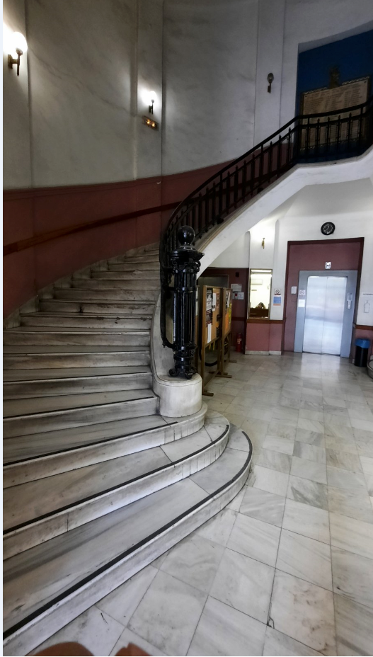
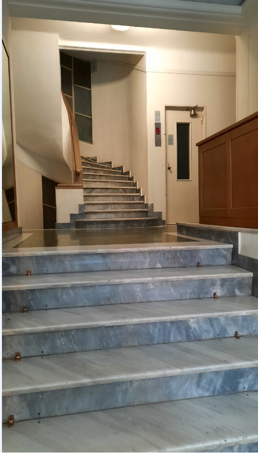
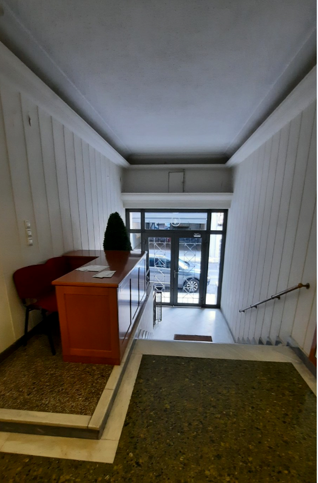

 
 
 

* [tasks](tasks.md)
* [summary](summary.md)
* [dev_log](dev_log.md)
* [links](links.md)

# eisodoi
Είσοδοι Αθηναϊκών κτηρίων με τη ματιά των Πάνουλα και Νίκουλα

## 01. Κτήριο Πανεπιστημίου Αθηνών, στην οδό Ιπποκράτους

 

`Φωτο 01-01`

----

 

`Φωτο 01-02`

----

 

`Φωτο 01-03`

----

 

`Φωτο 01-04`

----

## 02. Πολυκατοικία οδου Κερασούντος πλατεια Μαβίλλη

 

`Φωτο 02-01`

----

 

`Φωτο 02-02`

----

 

`Φωτο 02-03`

----

